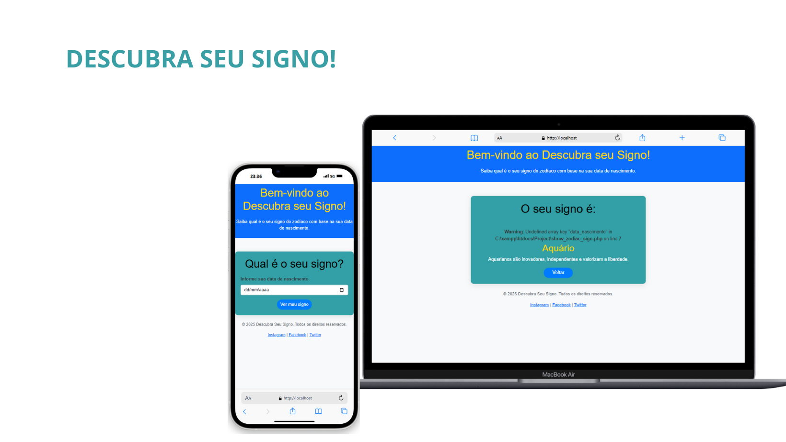

<h1 align="center">QUAL SEU SIGNO?</h1>

  <a href="#-tecnologias">Tecnologias</a>&nbsp;&nbsp;&nbsp;|&nbsp;&nbsp;&nbsp;
  <a href="#-projeto">Projeto</a>&nbsp;&nbsp;&nbsp;

 

  

## 🚀 Tecnologias

Esse projeto foi desenvolvido com as seguintes tecnologias:

- HTML, CSS & BOOTSTRAP
- PHP
- Git e Github

## 💻 Projeto

Este é o meu mais recente trabalho, um LAYOUT interativo onde você coloca sua data de nascimento e recebe a informação de qual é seu signo e uma mensagem sobre as Características de cada signo, construido em PHP e usando o XAMPP para rodar o projeto localmente na própria máquina(PC).

PROJETO CONSTRUIDO PARA OBTENÇÃO DE NOTA DO CURSO DE ENGENHARIA DE SOFTWARE.
